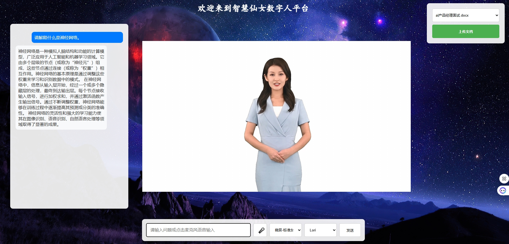

# 通用数字人系统

[English](README_EN.md) | 简体中文



## 项目简介

通用数字人系统是一个基于最新人工智能技术打造的智能对话系统，集成了语音识别、语音合成、自然语言处理和数字人渲染等多项前沿技术。系统支持实时语音对话、知识库问答、表情情感同步等功能，可广泛应用于智能客服、教育培训、数字展厅等多个场景。

## 注意事项
由于本项目使用的是微软的实时语音合成和虚拟形象服务，所需要的费用比较高，大家一定谨慎使用。即使挂机不做问答，也可能扣费。由于微软服务没有消费额度限制功能，本人已经被意外扣费2800多元，正在找回中，请谨慎使用。

### 项目特色

- **高性能实时渲染**
  - 视频帧率稳定在30FPS以上
  - 音视频延迟控制在200ms以内
  - 支持1080P高清画质输出

- **智能对话能力**
  - 支持长文本知识库实时检索
  - 多轮对话上下文记忆
  - 情感分析与表情同步

- **系统稳定性**
  - 分布式架构设计
  - 自动故障恢复
  - 完整的日志记录和监控

## 功能特点

- 🎭 **数字人实时渲染**
  - 基于微软Avatar技术的高品质数字人渲染
  - 支持多种数字人形象切换
  - 面部表情与语音情感同步

- 🗣️ **智能语音交互**
  - 实时语音识别与合成
  - 多种音色选择（普通话、方言等）
  - 情感化语音合成

- 📚 **知识库问答**
  - 支持多种格式文档导入（PDF、Word、TXT等）
  - 向量化存储与语义检索
  - 实时更新知识库

- 🤖 **智能对话**
  - 基于GPT的自然语言理解
  - 上下文记忆与多轮对话
  - 情感识别与回应

## 系统架构

```
+------------------+     +------------------+     +------------------+
|                  |     |                  |     |                  |
|  Web前端界面     |     |  FastAPI后端服务  |     |  Azure服务      |
|  (HTML/JS/CSS)   |<--->|  (Python)        |<--->|  (语音/Avatar)   |
|                  |     |                  |     |                  |
+------------------+     +------------------+     +------------------+
         ^                       ^                        ^
         |                       |                        |
         v                       v                        v
+------------------+     +------------------+     +------------------+
|                  |     |                  |     |                  |
|  WebRTC          |     |  向量数据库       |     |  OpenAI/Cohere  |
|  (音视频传输)     |     |  (ChromaDB)      |     |  (AI模型)       |
|                  |     |                  |     |                  |
+------------------+     +------------------+     +------------------+
```

## 技术栈

### 前端
- HTML5 + CSS3 + JavaScript
- WebRTC 实时音视频传输
- Azure Cognitive Services SDK
- 响应式设计

### 后端
- Python FastAPI 框架
- LangChain 大语言模型应用框架
- ChromaDB 向量数据库
- Redis 缓存

### AI模型与服务
- Azure Cognitive Services（语音服务、Avatar）
- OpenAI GPT（对话生成）
- Cohere（文本向量化）

## 安装使用

### 环境要求
- Python 3.10+
- Docker（用于运行Redis和Turnserver服务）

### 安装步骤

1. 克隆项目
```bash
git clone [项目地址]
cd general_digital_human_system
```

2. 安装依赖
```bash
pip install -r requirements.txt
```

3. 启动必要的服务

```bash
# 确保Docker服务已启动

# 检查并删除已存在的容器（如果需要重新创建）
docker rm -f redis-server turnserver_c

# 创建Docker网络（如果需要容器间通信）
docker network create digital-human-network

# 启动Redis服务（带密码保护）
docker run -d --name redis-server \
  -p 6379:6379 \
  redis:latest \
  --requirepass your_redis_password

# 启动Turnserver服务（用于WebRTC）
docker run -d \
  -p 3478:3478 \
  -p 3478:3478/udp \
  --name turnserver_c \
  coturn/coturn
```

4. 配置环境变量
```bash
cp .env.example .env

# 编辑.env文件，填入以下必要的配置信息：

# 网络代理配置（如果需要）
HTTP_PROXY=http://127.0.0.1:7890
HTTPS_PROXY=http://127.0.0.1:7890

# Azure服务配置
SUBSCRIPTION_KEY=your_azure_subscription_key
COGNITIVE_SERVICE_REGION=your_region

# OpenAI配置
OPENAI_API_KEY=your_openai_api_key

# Cohere配置
COHERE_API_KEY=your_cohere_api_key

# Redis配置（使用上面设置的密码）
REDIS_URL=redis://:your_redis_password@localhost:6379

# 搜索功能配置
SERPAPI_API_KEY=your_serpapi_key
```

5. 启动服务
```bash
python main.py
```

6. 访问系统
```
打开浏览器访问 http://localhost:8000
```

## 使用说明

1. **知识库管理**
   - 点击右上角"上传文档"按钮上传知识文档
   - 系统自动进行文档向量化处理
   - 在下拉菜单中选择需要使用的知识库

2. **语音交互**
   - 点击麦克风图标开始语音输入
   - 支持文本输入和语音输入切换
   - 可选择不同的语音音色

3. **数字人切换**
   - 在界面底部选择不同的数字人形象
   - 支持实时切换数字人

## 未来展望

1. **多模态交互**
   - 增加手势识别
   - 支持图像识别和处理
   - 3D场景互动

2. **个性化定制**
   - 自定义数字人形象
   - 个性化语音定制
   - 知识库深度训练

3. **场景拓展**
   - 元宇宙社交
   - 虚拟主播
   - 智能教育

4. **技术升级**
   - 支持更多大语言模型
   - 优化实时渲染性能
   - 增强多轮对话能力

## 开源协议

本项目采用 Apache License 2.0 协议开源，详情请参见 [LICENSE](LICENSE) 文件。

## Docker容器管理

### 常用命令
```bash
# 查看所有容器状态
docker ps -a

# 查看容器日志
docker logs redis-server
docker logs turnserver_c

# 重启容器
docker restart redis-server
docker restart turnserver_c

# 停止并删除所有容器
docker stop $(docker ps -aq)
docker rm $(docker ps -aq)

# 清理未使用的镜像和容器
docker system prune -a
```

### 故障排除

1. **Redis连接问题**
   - 检查Redis容器状态：`docker ps | grep redis-server`
   - 验证Redis密码：`docker exec -it redis-server redis-cli -a your_redis_password ping`
   - 查看Redis日志：`docker logs redis-server`

2. **Turnserver连接问题**
   - 检查端口是否开放：`netstat -an | findstr "3478"`
   - 查看Turnserver日志：`docker logs turnserver_c`
   - 确保防火墙允许UDP/3478端口

3. **容器网络问题**
   - 检查网络列表：`docker network ls`
   - 检查网络详情：`docker network inspect digital-human-network`
   - 重建网络：
     ```bash
     docker network rm digital-human-network
     docker network create digital-human-network
     ```

## 贡献指南

欢迎提交 Issue 和 Pull Request 贡献代码。在提交 PR 之前，请确保：

1. 代码风格符合项目规范
2. 添加必要的测试用例
3. 更新相关文档
4. 所有Docker相关的更改都经过测试

## 致谢

感谢以下开源项目的支持：

- FastAPI
- LangChain
- ChromaDB
- Azure Cognitive Services SDK
