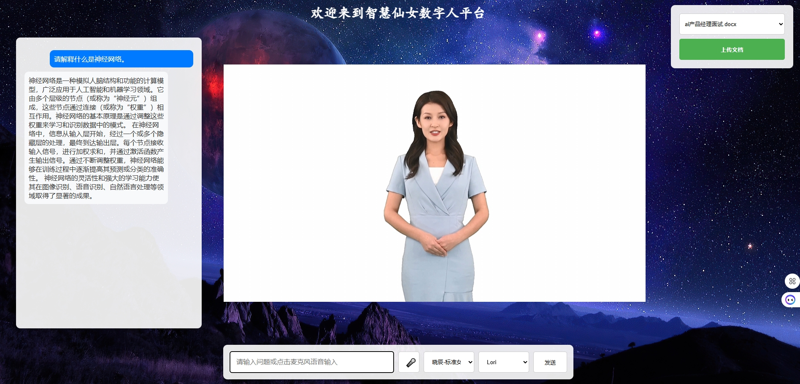

# General Digital Human System



## Project Overview

The General Digital Human System is an intelligent interaction platform built on cutting-edge AI technologies, integrating speech recognition, speech synthesis, natural language processing, and digital avatar rendering. The system supports real-time voice dialogue, knowledge Q&A, and emotional synchronization, making it suitable for various scenarios such as intelligent customer service, education training, and digital exhibitions.

## precautions
Due to the use of Microsoft's real-time speech synthesis and virtual image services in this project, the required cost is relatively high. Please be cautious when using them. 

### Project Highlights

- **High-Performance Rendering**
  - 30+ FPS stable frame rate
  - Audio-video latency under 200ms
  - 1080P HD output support

- **Intelligent Dialogue**
  - Real-time knowledge base retrieval
  - Multi-turn conversation memory
  - Emotion analysis and sync

- **System Stability**
  - Distributed architecture
  - Automatic fault recovery
  - Complete logging and monitoring

## Features

- 🎭 **Digital Avatar Rendering**
  - High-quality rendering based on Microsoft Avatar
  - Multiple avatar style switching
  - Facial expression and voice emotion sync

- 🗣️ **Intelligent Voice Interaction**
  - Real-time speech recognition and synthesis
  - Multiple voice options (Standard/Dialect)
  - Emotional voice synthesis

- 📚 **Knowledge Base Q&A**
  - Support multiple document formats (PDF, Word, TXT)
  - Vector storage and semantic retrieval
  - Real-time knowledge base updates

- 🤖 **Intelligent Dialogue**
  - GPT-based natural language understanding
  - Context memory and multi-turn dialogue
  - Emotion recognition and response

## System Architecture

```
+------------------+     +------------------+     +------------------+
|                  |     |                  |     |                  |
|  Web Frontend    |     |  FastAPI Backend |     |  Azure Services  |
|  (HTML/JS/CSS)   |<--->|  (Python)        |<--->|  (Speech/Avatar) |
|                  |     |                  |     |                  |
+------------------+     +------------------+     +------------------+
         ^                       ^                        ^
         |                       |                        |
         v                       v                        v
+------------------+     +------------------+     +------------------+
|                  |     |                  |     |                  |
|  WebRTC          |     |  Vector Database |     |  OpenAI/Cohere  |
|  (A/V Transfer)  |     |  (ChromaDB)      |     |  (AI Models)    |
|                  |     |                  |     |                  |
+------------------+     +------------------+     +------------------+
```

## Technology Stack

### Frontend
- HTML5 + CSS3 + JavaScript
- WebRTC real-time A/V transmission
- Azure Cognitive Services SDK
- Responsive design

### Backend
- Python FastAPI framework
- LangChain LLM framework
- ChromaDB vector database
- Redis cache

### AI Models & Services
- Azure Cognitive Services (Speech & Avatar)
- OpenAI GPT (Dialogue)
- Cohere (Text Vectorization)

## Installation

### Requirements
- Python 3.10+
- Docker (for Redis and Turnserver)

### Setup Steps

1. Clone the repository
```bash
git clone [repository_url]
cd general_digital_human_system
```

2. Install dependencies
```bash
pip install -r requirements.txt
```

3. Start required services

```bash
# Ensure Docker service is running

# Check and remove existing containers (if needed)
docker rm -f redis-server turnserver_c

# Create Docker network
docker network create digital-human-network

# Start Redis server (with password)
docker run -d --name redis-server \
  -p 6379:6379 \
  redis:latest \
  --requirepass your_redis_password

# Start Turnserver (for WebRTC)
docker run -d \
  -p 3478:3478 \
  -p 3478:3478/udp \
  --name turnserver_c \
  coturn/coturn
```

4. Configure environment variables
```bash
cp .env.example .env

# Edit .env file with required configurations:

# Network proxy (if needed)
HTTP_PROXY=http://127.0.0.1:7890
HTTPS_PROXY=http://127.0.0.1:7890

# Azure service configuration
SUBSCRIPTION_KEY=your_azure_subscription_key
COGNITIVE_SERVICE_REGION=your_region

# OpenAI configuration
OPENAI_API_KEY=your_openai_api_key

# Cohere configuration
COHERE_API_KEY=your_cohere_api_key

# Redis configuration
REDIS_URL=redis://:your_redis_password@localhost:6379

# Search functionality
SERPAPI_API_KEY=your_serpapi_key
```

5. Start the service
```bash
python main.py
```

6. Access the system
```
Open browser and visit http://localhost:8000
```

## Usage Guide

1. **Knowledge Base Management**
   - Click "Upload Document" button to upload knowledge files
   - System automatically processes document vectorization
   - Select knowledge base from dropdown menu

2. **Voice Interaction**
   - Click microphone icon to start voice input
   - Switch between text and voice input
   - Select different voice options

3. **Avatar Switching**
   - Select different avatars at the bottom
   - Support real-time avatar switching

## Future Plans

1. **Multi-modal Interaction**
   - Add gesture recognition
   - Support image recognition
   - 3D scene interaction

2. **Personalization**
   - Custom avatar creation
   - Voice customization
   - Knowledge base deep training

3. **Scenario Expansion**
   - Metaverse social interaction
   - Virtual broadcasting
   - Intelligent education

4. **Technical Upgrades**
   - Support more LLMs
   - Optimize rendering performance
   - Enhance multi-turn dialogue

## Docker Container Management

### Common Commands
```bash
# View all container status
docker ps -a

# View container logs
docker logs redis-server
docker logs turnserver_c

# Restart containers
docker restart redis-server
docker restart turnserver_c

# Stop and remove all containers
docker stop $(docker ps -aq)
docker rm $(docker ps -aq)

# Clean unused images and containers
docker system prune -a
```

### Troubleshooting

1. **Redis Connection Issues**
   - Check Redis container status: `docker ps | grep redis-server`
   - Verify Redis password: `docker exec -it redis-server redis-cli -a your_redis_password ping`
   - View Redis logs: `docker logs redis-server`

2. **Turnserver Connection Issues**
   - Check port availability: `netstat -an | findstr "3478"`
   - View Turnserver logs: `docker logs turnserver_c`
   - Ensure firewall allows UDP/3478 port

3. **Container Network Issues**
   - Check network list: `docker network ls`
   - Check network details: `docker network inspect digital-human-network`
   - Rebuild network:
     ```bash
     docker network rm digital-human-network
     docker network create digital-human-network
     ```

## License

This project is licensed under the Apache License 2.0 - see the [LICENSE](LICENSE) file for details.

## Contributing

Welcome to submit Issues and Pull Requests. Before submitting a PR, please ensure:

1. Code follows project style guidelines
2. Add necessary test cases
3. Update relevant documentation
4. All Docker-related changes are tested

## Acknowledgments

Thanks to the following open-source projects:

- FastAPI
- LangChain
- ChromaDB
- Azure Cognitive Services SDK
